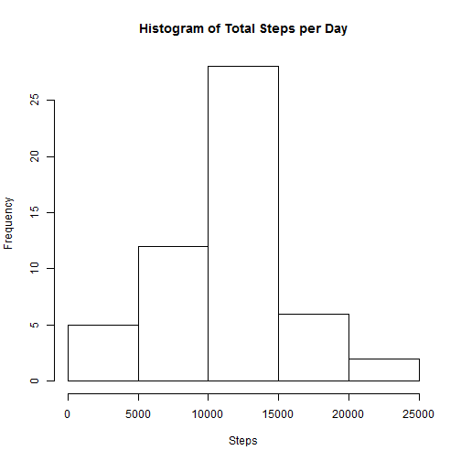
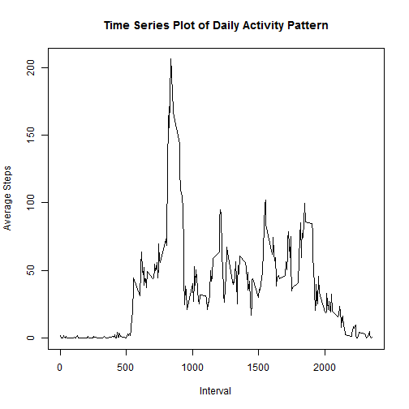
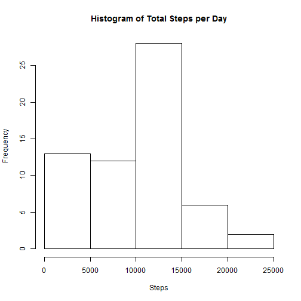
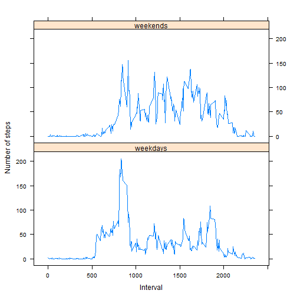

# Reproducible Research: Peer Assessment 1


## Loading and preprocessing the data

```r
setwd("~/GitHub/RepData_PeerAssessment1")
data <- read.csv("activity.csv")
dataDailySteps <- aggregate(steps ~ date, data = data, FUN = "sum")
dataDailyAverage <- aggregate(steps ~ interval, data = data, FUN = "mean")
```
  
  
    
## What is mean total number of steps taken per day?

```r
hist(dataDailySteps$steps, xlab = "Steps", main = "Histogram of Total Steps per Day")
```

 

```r
meanSteps <- mean(dataDailySteps$steps)
medianSteps <- median(dataDailySteps$steps)
```
  
The original mean and median values of the total number of steps taken per day are:  
- The mean = 1.0766 &times; 10<sup>4</sup> 
- The median = 10765
    
  
    
## What is the average daily activity pattern?

```r
plot(x = dataDailyAverage$interval, 
     y =  dataDailyAverage$steps, 
     type = "l", 
     xlab = "Interval", ylab = "Average Steps", 
     main = "Time Series Plot of Daily Activity Pattern")
```

 

```r
maxStepsInterval = head(dataDailyAverage[order(-dataDailyAverage$steps), 1], n = 1)
```
  
The 5-minute interval which contains the maximum number of steps on average across all the days in the dataset is 835
  
  
  
## Imputing missing values

```r
## Getting the number of rows with the missing values
missingValues <- sum(is.na(data$steps))

## Replace missing values with the interval median
dataClean <- data
dataMissing <- unique(subset(data, is.na(steps), select = interval))

for(i in 1:nrow(dataMissing))
  {
    medianReplace <- median(
      subset(data, interval == dataMissing[i, 1] & !is.na(steps), select = steps, drop = TRUE), 
      na.rm = TRUE)
    
    dataClean[is.na(dataClean$steps) & dataClean$interval == dataMissing[i, 1], 1] <- medianReplace
  }

dataCleanDailySteps <- aggregate(steps ~ date, data = dataClean, FUN = "sum")
hist(dataCleanDailySteps$steps, xlab = "Steps", main = "Histogram of Total Steps per Day")
```

 

```r
meanCleanSteps <- mean(dataCleanDailySteps$steps)
medianCleanSteps <- median(dataCleanDailySteps$steps)

meanDiff <- meanCleanSteps - meanSteps
medianDiff <- medianCleanSteps - medianSteps
```
  
The total number of missing values in the dataset is 2304
  
After missing values have been replaced, the current mean and median values of the total number of steps taken per day are:  
- The mean = 9503.8689 
- The median = 10395  
  
The differences between before and after the missing values have been processed are:  
- The mean = -1262.3198
- The median = -370
  
  
  
## Are there differences in activity patterns between weekdays and weekends?

```r
##Create factors
dataActivity <- dataClean
dataActivity["dayname"] <- weekdays(as.Date(dataActivity$date), abbreviate = TRUE)
dataActivity["daytype"] <- NA
dataActivity[dataActivity$dayname == "Sat" | dataActivity$dayname == "Sun", 5] <- "weekends"
dataActivity[is.na(dataActivity$daytype), 5] <-  "weekdays"

## Create plots
library(lattice)
dataDayType <- aggregate(steps ~ interval + daytype, data = dataActivity, FUN = "mean")
xyplot(dataDayType$steps ~ dataDayType$interval | dataDayType$daytype, 
       layout = c(1, 2), 
       type = "l",
       xlab = "Interval",
       ylab = "Number of steps")
```

 

